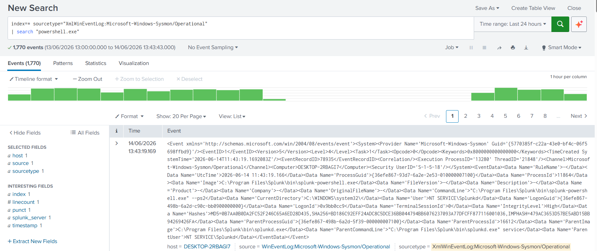
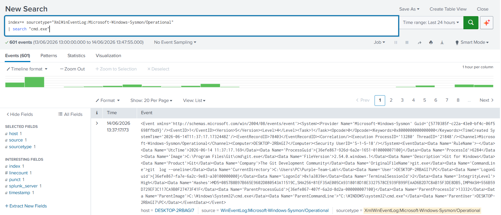
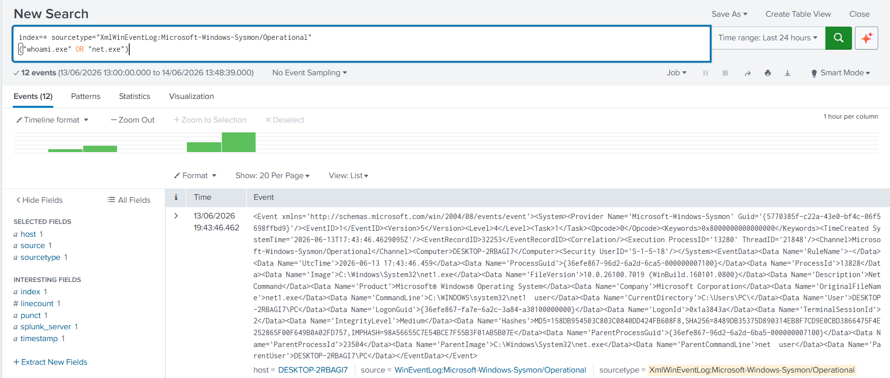
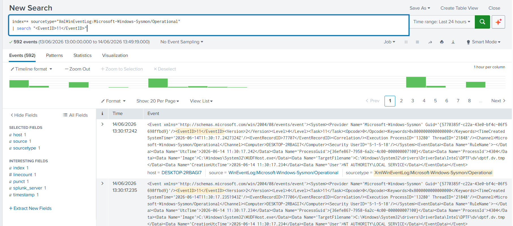

## Detection Scenarios

### 1. PowerShell Execution

**Objective:** Detect PowerShell execution activity and validate process creation monitoring.

**MITRE ATT&CK:** T1059.001 – PowerShell

**Evidence:**



---

### 2. Command Shell Execution

**Objective:** Detect execution of Windows Command Prompt.

**MITRE ATT&CK:** T1059.003 – Windows Command Shell

**Evidence:**



---

### 3. Account Discovery

**Objective:** Detect account enumeration activity using native Windows commands.

**MITRE ATT&CK:** T1087 – Account Discovery

**Evidence:**



---

### 4. File Creation Activity

**Objective:** Detect file creation events using Sysmon Event ID 11.

**MITRE ATT&CK:** T1074 – Data Staged

**Evidence:**



---

## MITRE ATT&CK Coverage

| Technique ID | Technique             |
| ------------ | --------------------- |
| T1059.001    | PowerShell            |
| T1059.003    | Windows Command Shell |
| T1087        | Account Discovery     |
| T1074        | Data Staged           |

---

## Repository Structure

```text
Purple-Team-Lab
│
├── README.md
│
├── attack-scenarios
│   └── powershell_execution.md
│
├── detections
│
└── screenshots
    ├── powershell_execution.png
    ├── command_shell.png
    ├── account_discovery.png
    └── file_creation.png
```

---

## Key Takeaways

* Purple Team exercises improve detection coverage by validating security monitoring against simulated attacker activity.
* Sysmon provides detailed visibility into process creation, file activity, and command execution.
* Splunk enables rapid detection development and validation.
* MITRE ATT&CK mapping helps measure defensive coverage against known adversary techniques.
* Detection engineering and threat hunting are closely aligned within Purple Team operations.

## Purple Team Methodology

The Purple Team approach combines offensive security techniques with defensive monitoring capabilities.

In this lab, attacker activities were simulated on a Windows endpoint while Sysmon telemetry was collected and analyzed through Splunk Enterprise.

Each activity was validated against corresponding detections to ensure visibility and monitoring coverage.

---

## Detection Workflow

The detection development process followed these steps:

1. Simulate attacker behavior
2. Generate Windows telemetry
3. Collect events using Sysmon
4. Ingest logs into Splunk
5. Develop detection logic
6. Validate detection results
7. Map activity to MITRE ATT&CK
8. Document findings

---

## Lessons Learned

* Process creation events provide valuable visibility into attacker execution techniques.
* PowerShell remains one of the most important sources of security telemetry.
* Account discovery activity can often be detected using native Windows command execution.
* File creation events help identify staging and payload deployment activity.
* Detection validation is critical to ensure monitoring effectiveness.

---

## Future Enhancements

Future improvements may include:

* Credential Access scenarios
* Persistence techniques
* Scheduled Task monitoring
* Registry modification detections
* Lateral Movement simulations
* Sigma rule development
* Splunk alert creation
* Detection-as-Code integration
* MITRE ATT&CK coverage dashboards

